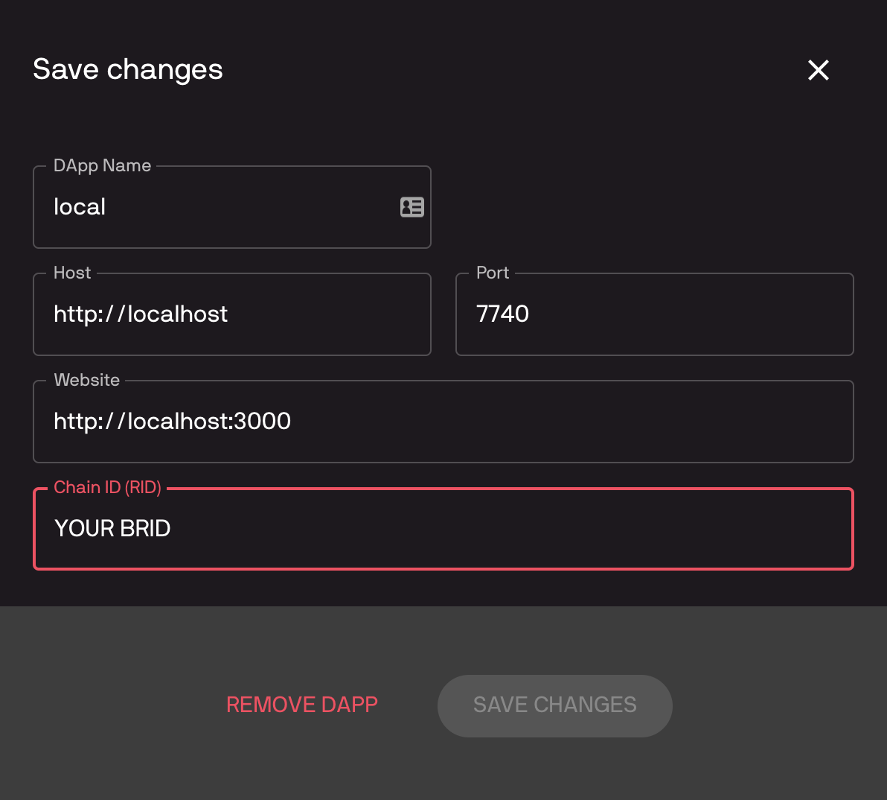

# How to run

* turn on postgres on port 5432 (or use docker (./postchain folder) with `docker-compose up -d` and change db connection to http://0.0.0.0:5433 )
* Turn on blockchain `./postchain/bin/run-node.sh dev [-W]`

With `-W` you can wipe the db.

* `cd test`
* `npm install` if needed
* change the `.env` file with the new BRID displayed when wiping the node at step 2
* `npm start`
* go to `https://dev.vault.chromia-development.com/`
* Register if you don't have a decentralized account
* Click on Add custom dapp with this setting 

* set BRID with the new BRID displayed when wiping the node at step 2

* now you can try to login at `http://localhost:3000`